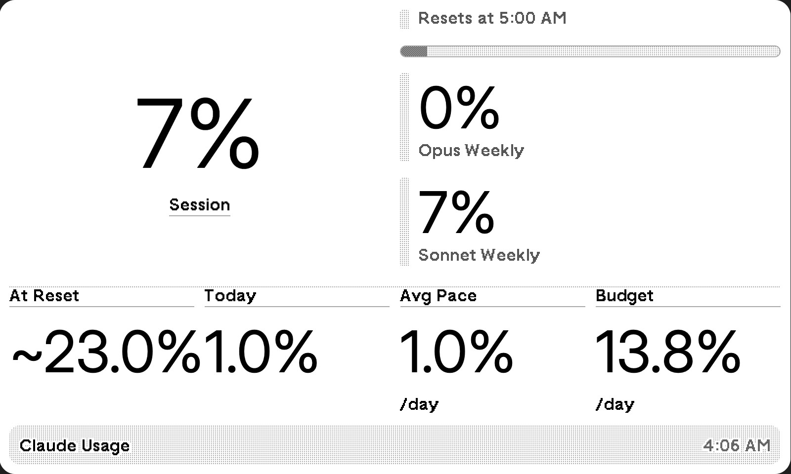

# trmnl-claude-usage

Display your Claude Pro/Team usage stats on a [TRMNL](https://usetrmnl.com/) e-ink dashboard.



## Features

- Session and weekly usage percentages (Opus & Sonnet)
- Usage projections: projected % at reset, daily pace, remaining budget per day
- "Hits limit" warning when you're on track to exhaust your quota before reset
- Web UI for configuration (session key, org selection, webhook URL)
- Auto-refreshes on a configurable interval (default: 15 minutes)
- Expired session key detection with on-screen alert

## Prerequisites

- [Docker](https://docs.docker.com/get-docker/) and Docker Compose
- A [TRMNL](https://usetrmnl.com/) account with a Private Plugin webhook
- A Claude Pro or Team subscription on [claude.ai](https://claude.ai)

## Quick Start

```bash
git clone https://github.com/edsai/trmnl-claude-usage.git
cd trmnl-claude-usage
cp .env.example .env
# Edit .env with your values
docker compose up -d
```

Then open `http://localhost:8085` in your browser to configure.

## Configuration

### Environment Variables

| Variable | Required | Default | Description |
|---|---|---|---|
| `TRMNL_WEBHOOK_UUID` | Yes | — | Your TRMNL Private Plugin webhook UUID |
| `WEB_PASSWORD` | Yes | `changeme` | Password for the web config UI |
| `FETCH_INTERVAL_MINUTES` | No | `15` | How often to fetch usage data (minutes) |

### Web UI Setup

1. Open `http://localhost:8085` and log in with your `WEB_PASSWORD`
2. Paste your `sessionKey` cookie from claude.ai (DevTools > Application > Cookies)
3. Select your organization
4. Enter your TRMNL webhook URL (`https://usetrmnl.com/api/custom_plugins/YOUR_UUID`)

## TRMNL Plugin Setup

1. Create a **Private Plugin** in your TRMNL dashboard
2. Set Strategy to **Webhook**
3. Copy the webhook URL into the web UI at `http://localhost:8085`
4. In the plugin **Markup** editor, paste the contents of [`src/app/trmnl-template.html`](src/app/trmnl-template.html)
   - The template includes layouts for full, half, and quadrant views

## How Projections Work

The app takes a daily snapshot of your weekly usage percentage. Using the rate of change across snapshots, it calculates:

- **Projected at reset**: Where your usage will be when the weekly quota resets
- **Avg daily pace**: Your average daily consumption rate
- **Budget per day**: How much you can use per day to stay within limits
- **Hits limit**: If you're on pace to hit 100% before reset, shows when

Snapshots reset automatically when a weekly quota reset is detected.

## License

[MIT](LICENSE)
